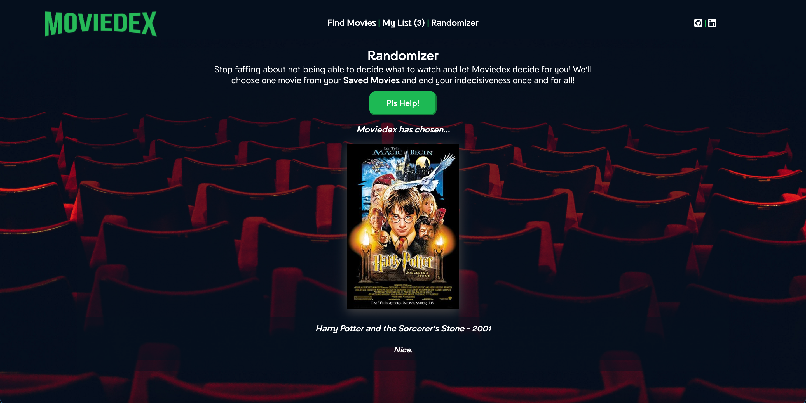

# Moviedex

## Summary:

The purpose of Moviedex is to help users decide on what movie to watch, from a list of saved movies they'd like to watch.
Moviedex is a React web application that allows users to call a public movie API, [OMDb](https://www.omdbapi.com/), save/delete those movies to/from Moviedex's server, and then click a button to randomly generate one of those movies as the selected movie to watch.

## Technology:

Moviedex was made using a server-side program that can be found here:
* [Moviedex-server](https://github.com/zacharyjameson/moviedex-server)

Technology Used:
* React
* JSX
* CSS
* PostgreSQL
* Node.js
* Express

## Live Version:

[Moviedex](https://moviedex-client.vercel.app/)

## Screenshots

### Home Page

### Find Movies Page

### My List Page
 

### Randomizer Page

